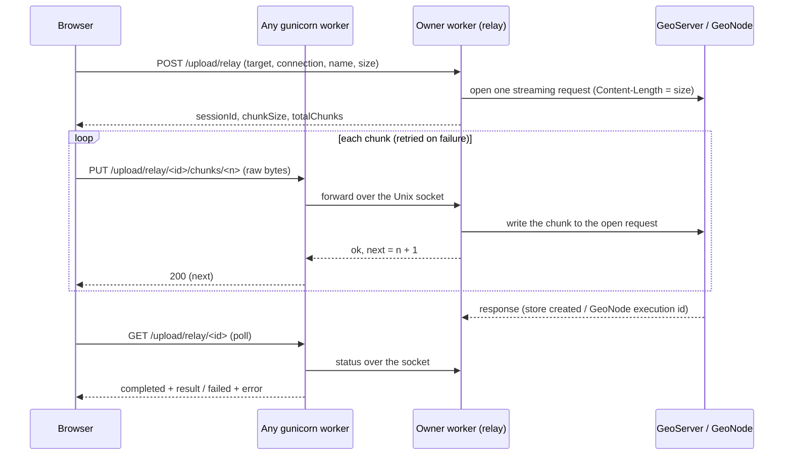

# Upload passthrough to GeoServer and GeoNode

Status: **implemented** on branch `feat/upload-passthrough` (option A below), and tested
against GeoHosting staging. See [Testing](#testing) and [Known limits](#known-limits).

## Problem

Uploading a file to GeoServer or GeoNode through CloudBench stores it on CloudBench's
own volume first. In production, that volume is a 10 Gi PVC
(`cloudbench-folder-pvc`), so one big upload can fill it.

The goal is for CloudBench to pass the file straight through to GeoServer/GeoNode
without saving it locally.

## How it worked before

For a 10 GB file:

1. Every 5 MB chunk is written to `cache/uploads/<session>/chunk_N`, so **10 GB on disk**.
   Django's multipart parser also spools each chunk (above 2.5 MB) to a temp file first.
2. `_assemble_file` copies all chunks into a new file and keeps the chunks, so **20 GB on disk**.
3. The whole file is loaded with `f.read()`, so **10 GB in RAM**, and is then sent in one request.
4. The GeoServer push (`upload/start`) runs inside the request on a `sync` gunicorn worker
   with `timeout = 120`, and the GeoNode client also uses a 120 s timeout. A big file usually fails here anyway.

The chunking gives no retry today. A chunk that fails ends the whole upload. Its only real
features are pause/resume and keeping each request under the ingress body limit (2G).

## Constraints

- **Any GeoServer/GeoNode.** CloudBench connects to instances it doesn't run, so we can
  only use their standard APIs. We can't rely on extensions, shared storage, or their proxy
  settings.
- **Neither target accepts chunked or resumable uploads.** GeoServer REST
  (`PUT .../file.{shp,geotiff,gpkg}`) and GeoNode (`POST /api/v2/uploads/upload`,
  `POST /api/v2/documents/`) take the whole file in one request. GeoServer's resumable
  upload exists only as a community module (GEOS-6886).
  So the file must reach the target as **one streaming request**.
- **The request to the target needs a `Content-Length`.** Many GeoServer/GeoNode instances
  run behind nginx or uwsgi, which often reject `Transfer-Encoding: chunked`. We know the
  file size up front, so we can always send it.
- **No Redis.** The standalone `docker-compose.yml` has none (Celery was removed), and
  CloudBench in GeoHosting doesn't use one either.
- **Production** (kartoza-devops `geohosting` app): ingress-nginx with `proxy-body-size: 2G`,
  request buffering on (the default), no Cloudflare in front, 1 replica,
  `GUNICORN_WORKERS=4` with `sync` workers.
- **Requirements from review:** pause is not needed (it should not be possible to pause).
  Resuming after the connection drops is needed.

## Findings

### Does the target need to support "stream upload"?

No. "Streaming" here only describes how **CloudBench** produces the request body: it sends
bytes as they arrive instead of reading a whole file first. On the wire, the request is the
same normal upload the targets accept today:

- **GeoServer** gets an ordinary `PUT .../file.<ext>` with a `Content-Length`.
- **GeoNode** gets an ordinary multipart `POST` with a `Content-Length`.

HTTP always delivers a body as a stream of TCP packets, so the receiver can't tell, and
doesn't need to know, whether the sender had the whole file at hand. No GeoServer or
GeoNode change or extension is needed for the design below.

What a target *can* do is **refuse a large upload**, whichever way CloudBench sends it.
Those limits apply today too:

- **GeoNode upload size limit: 100 MB by default.** It's set from `DEFAULT_MAX_UPLOAD_SIZE`
  at install, has separate values for datasets and documents, and only a GeoNode admin
  can raise it (admin panel or API). Over the limit, GeoNode answers
  "Total upload size exceeds …". GeoNode checks the request size early in a custom upload
  handler, so the request is refused quickly instead of after the whole file is sent.
- **The proxy in front of the target** (`client_max_body_size`, `client_body_timeout`).
- **GeoServer** has no upload size limit of its own in the REST API.

So for GeoNode, a big upload works only if that GeoNode's admin has raised its upload
limit. CloudBench can't change that. It can only surface GeoNode's error clearly, and could
check the limit before starting if the GeoNode API exposes it (to verify).

### Security issue in the old flow (fixed: the endpoint is removed)

`POST /api/upload/start/<conn>/<ws>` (`GeoServerUploadStartView`) takes `filePath`
from the request body without validating it:

1. It reads that file and sends it to the GeoServer chosen by the caller.
2. Afterwards, `run_geoserver_upload` calls `_cleanup`, which runs
   `shutil.rmtree(Path(file_path).parent)`, even for unsupported file types.

Any user who can call the API can therefore read an arbitrary file the CloudBench process
can read, and **delete any directory it can write**. That includes the data folder, for
example with `filePath=/home/web/cloudbench_data/<anything>`.

The endpoint is removed. The new relay endpoints check that the upload belongs to the
requesting user. The chunked endpoints still used by the PostgreSQL import
(`upload/chunk`, progress, cancel) still don't check ownership.

## Options considered

### A. Chunked upload relayed into one streaming request — **chosen**

The browser keeps sending chunks. CloudBench opens one streaming request to the target
and feeds each chunk into it as it arrives, holding only a few chunks in memory.
This is the only option that supports resuming after a dropped connection without
storing the file. The details are below.

### B. One streaming request from the browser — rejected

The browser sends the whole file in one request (`xhr.send(file)`), and CloudBench streams
the body straight on to the target. It's the least code, and there are no chunks.

Rejected because **a dropped connection means starting again from zero**, and resume is a
requirement. It also needs ingress changes (`proxy-request-buffering: "off"`, a larger body
size, longer timeouts) on every deployment, or nginx stores the whole file on its own disk.

### C. Stage in S3/MinIO — rejected

The browser uploads straight to a bucket (presigned multipart), and GeoServer fetches it
via `PUT .../url.{ext}`. CloudBench streams the file from the bucket to GeoNode.

Rejected because the targets are arbitrary GeoServer/GeoNode instances:

- We don't use S3 for them, and they keep data on their own (inaccessible) PVCs.
- A third-party GeoServer may not be able to reach our bucket at all.
- Uploads would depend on the user having an S3 connection.

### A2. Option A with Redis between the workers — rejected

Each chunk can land in any of the 4 gunicorn workers, but only one worker holds the
request to the target. Redis could carry the chunks between them.

Rejected because it adds Redis to every deployment. The standalone compose has none, and
sharing GeoHosting's Redis would tie CloudBench to GeoHosting.

### A1. Option A with a single gunicorn worker — rejected

With one process (`workers = 1`, many `gthread` threads), all chunks land in the process
that holds the relay, so an in-memory queue is enough. It's the simplest version of A.

Rejected to keep `GUNICORN_WORKERS=4`: with one process, a crash or out-of-memory kill
takes the whole app down until gunicorn restarts it.

### Quick fix only — not enough

We could write chunks straight into one file (no second copy) and stream that file to the
target instead of `f.read()`. That halves the disk use and removes the RAM use, but the file
is still stored locally. It doesn't solve the problem.

## Design

### Relay (owner worker)

- The worker that handles `POST /upload/relay` starts the relay. The relay checks the
  connection, opens the streaming request to the target (body = a generator over a bounded
  queue), and listens on a Unix socket at `/tmp/cloudbench-upload/<session_id>.sock`.
- The socket path comes from the session id, so **no new database fields or migration**
  are needed. All workers share the container's `/tmp`.
- **Every** chunk request goes through the socket, even when it lands in the owner worker.
  That keeps a single code path, and the same code works with 1 or N workers.

### Chunks

- Chunks are sent as `PUT` with a raw body (`application/octet-stream`), not multipart.
  That way Django doesn't spool them to a temp file. A chunk stays 5 MB, in memory only.
- The relay accepts:
  - chunk `next` → queued for the target and acknowledged;
  - a chunk below `next` → acknowledged without being sent again (it's a retry of one
    that already arrived);
  - a chunk above `next` → rejected with `409`, with `next` in the response.
- **Backpressure:** the queue holds at most 3 chunks (~15 MB per upload). When it's full, a
  chunk request waits until there's room, so the browser never runs ahead of the target.
- A chunk request is acknowledged once its chunk is queued, not once it reaches the target.
  A failure on the target side shows up in the next chunk's response or in the status.

### Resume and its limits

- **Browser → CloudBench drops:** resumable. The browser retries the chunk with backoff
  (1, 2, 4, 8, 16 s). The request to the target stays open in the meantime.
- **The window is short.** While the browser is gone, the target receives nothing, and the
  proxy in front of most GeoServer/GeoNode instances times out an idle request body after
  about 60 s (nginx `client_body_timeout`), which we can't change. So we resume drops
  shorter than about a minute (Wi-Fi hiccups, network switches). The relay also gives up
  after `UPLOAD_RELAY_IDLE_TIMEOUT` (default 60 s) with no chunk, and the browser then
  says the upload must start over.
- **CloudBench → target drops:** not resumable. The target can't continue an upload, so it
  starts over.
- **Page reload:** not covered. After a reload, the browser can no longer read the file.

### Finishing

- After the last chunk, the relay waits for the target's response, which can take a while
  (GeoServer reads the shapefile, GeoNode starts its import).
- The browser **polls** `GET /upload/relay/<id>` instead of waiting in one request, so the
  ingress's default 60 s read timeout doesn't cut it off.
- The relay writes `completed`/`error` to the `UploadSession` row and keeps the result in
  memory for 10 minutes for the status endpoint. If the socket is gone, the status reads
  from the row; if the row is not finished either, the upload failed (worker restarted).

### Cancel

`DELETE /upload/relay/<id>` sends `cancel` over the socket. The relay aborts the request to
the target, and the target throws away the partial upload.

### Ownership

Every relay endpoint checks that the session belongs to `request.user`. The current
upload endpoints don't.

### Targets

- **GeoServer:** `PUT /rest/workspaces/<ws>/datastores|coveragestores/<store>/file.<ext>`
  with the body streamed and an explicit `Content-Length`. The store name is fixed when the
  upload starts.
- **GeoNode:** the multipart body (form fields, file part, closing boundary) is built by hand
  so its exact `Content-Length` is known before the file arrives. The file is streamed
  inside the file part. Dataset and document uploads both work this way.
- **GeoNode zipped shapefiles:** GeoNode 4.x only unzips a zip sent as `zip_file`, then puts
  the `.shp` it finds in place of `base_file`. `base_file` must still be present and not
  empty, but its content isn't read. A stream can send the zip only once, so the zip goes
  as `zip_file` and `base_file` is a 1-byte stand-in. (The old code sent the zip twice.)
- **GeoNode size limit:** before anything is sent, CloudBench reads
  `GET /api/v2/upload-size-limits/` (`dataset_upload_size` / `document_upload_size`,
  `file_upload_handler`). A file over the limit is refused with `413` and a message saying
  the GeoNode admin can raise it. GeoNodes without that API are tried anyway.
- **Errors known only at the end:** a target answers only once the whole body is in, so
  everything that can be checked first is: the connection, the workspace (GeoServer), the
  size limit (GeoNode), the file type and store name.

### Gunicorn

- `worker_class = "gthread"`, with `threads` from `GUNICORN_THREADS` (default 8).
  `GUNICORN_WORKERS` stays 4. A chunk request waiting on backpressure holds a thread,
  not a whole worker.
- `max_requests` is now **100000** (`GUNICORN_MAX_REQUESTS`; it was `1000`). Gunicorn
  restarts a worker once it has served that many requests (+ up to `max_requests_jitter`),
  counted since the worker started, not since the upload did. Restarting the worker that
  holds an upload kills its relay threads and so the upload. A 10 GB upload is ~2000 chunk
  requests plus status polls, ~500 per worker: with `1000`, a big upload was likely to meet
  a restart; with `100000` it's ~0.5% for a 10 GB upload, less for smaller ones. It stays as
  a guard against a slow memory leak (background conversions are cut the same way).

## What changed

**Backend**

- New `apps/upload/relay.py`: relay (socket server, bounded queue, sender thread, idle
  timeout, state) and a small client used by the views (`send_chunk`, `status`, `cancel`).
- Streaming upload methods: `GeoServerClient.upload_store_file`,
  `GeoNodeClient.upload_dataset` / `upload_document` (body iterator + `Content-Length`),
  and `GeoNodeClient.get_upload_size_limit`.
- New endpoints in `apps/upload`: `POST /upload/relay`, `PUT /upload/relay/<id>/chunks/<n>`,
  `GET` and `DELETE /upload/relay/<id>`.
- Removed: `GeoServerUploadCompleteView`, `GeoServerUploadStartView`,
  `GeoServerUploadStatusView`, `apps/geoserver/tasks.py` (`run_geoserver_upload`),
  `GeoNodeUploadCompleteView`, and their URLs. Also the unused whole-file endpoints
  `/api/upload/complete` (`UploadCompleteView`) and `/api/upload` (`SimpleUploadView`),
  and the GeoServer client's `upload_shapefile` / `upload_geotiff` / `upload_geopackage`.
- Settings: `UPLOAD_RELAY_SOCKET_DIR`, `UPLOAD_RELAY_IDLE_TIMEOUT`,
  `UPLOAD_RELAY_RESPONSE_TIMEOUT`. No migration: `UploadSession` is reused as it is.
- `deployment/docker/gunicorn.conf.py`: `gthread`, `GUNICORN_THREADS`, `max_requests`.

**Frontend**

- New `web/src/api/relayUpload.ts`: relay calls, chunk retry with backoff, status polling.
  `chunkedUpload.ts` keeps only what the PostgreSQL import uses.
- `UploadDialog` (GeoServer): no "ready" step between assembling and publishing, and no
  pause button. A "Connection lost — retrying" note shows while a chunk is retried.
- `GeoNodeUploadDialog`: title/abstract/type are sent when the upload starts. No pause button.
- Removed what nothing used: `useChunkedUpload.ts`, `uploadFile` (`/api/upload`),
  `uploadGeoNodeDataset` (its backend route didn't exist) and the `UploadResult` type.
- The bundle in `static/` isn't tracked; the Docker build makes it.

**Deployment and docs**

- kartoza-devops: **no change needed** (chunks stay 5 MB, under `proxy-body-size: 2G`;
  `GUNICORN_WORKERS=4` stays; `gthread` and `max_requests` come with the image).
- `.template.env`, `docs/admin-guide/environment.md`, `docs/user-guide/uploads.md`,
  `docs/dev-guide/api.md`.

**Out of scope**

The PostgreSQL upload (`pg/upload/complete`) keeps the current disk-based flow
(`upload/init`, `upload/chunk`), because `ogr2ogr`/`raster2pgsql` need a local file.

## Testing

- **Unit tests** (`tests/unit/test_upload_relay.py`, GeoNode client tests): chunk order,
  retries acknowledged once, wrong size/place refused, idle timeout, target failing
  mid-stream, cancel, backpressure, ownership, GeoNode size limit, multipart
  `Content-Length`. One test runs a real HTTP server to check the wire: `Content-Length`,
  no `Transfer-Encoding`.
- **Real gunicorn, 4 `gthread` workers**, fake GeoServer: a 30 MB file in 6 chunks over
  fresh connections. Chunks landed in two different workers and still reached the relay;
  the fake GeoServer got exactly 31,457,280 bytes with the same SHA-256, `Content-Length`
  set, no chunked encoding. A chunk sent twice was sent on once. Nothing was written to
  CloudBench's data folder.
- **GeoHosting staging** (GeoNode 4.x with its GeoServer), with **20 s without a chunk**
  mid-upload:
  - GeoServer: a 12.8 MB GeoTIFF (3 chunks) became a coverage store with the full
    2000×1600 grid; a zipped shapefile became a data store. Both published as layers.
  - GeoNode: the GeoTIFF dataset imported (`GeoTiffFileHandler`, finished); the zipped
    shapefile imported with both points (via `zip_file` + stand-in `base_file`); a `.txt`
    document was created.
  - Everything created was deleted afterwards.

## Known limits

- **Resume window:** a dropped browser connection resumes within ~60 s
  (`UPLOAD_RELAY_IDLE_TIMEOUT`, and the target's own proxy timeout). The browser retries for
  ~30 s (1, 2, 4, 8, 16 s). After that, or after a page reload, the upload starts over.
- **CloudBench → target drops** can't resume.
- **One container:** the workers meet over a Unix socket in the container's `/tmp`.
  Several replicas would need sticky sessions per upload (or Redis, see A2).
- **Deploys and restarts** cut off running uploads, as they do for conversions.
- **GeoNode's own upload limit** still applies (100 MB by default, 5 GB on GeoHosting).
- **Newer GeoNodes** (`master`) dropped `zip_file` and take a zip as `base_file`; zipped
  shapefiles to those aren't covered (the stand-in `base_file` would be read). GeoNode
  publishes no version to choose by.
- **Document types** are GeoNode's: e.g. `.geojson` is refused as a document by
  GeoHosting's GeoNode ("not in the supported extensions list").

## Open questions

1. Zipped shapefiles to newer GeoNodes (no `zip_file`): needed? If so, a per-connection
   setting could choose how zips are sent.
